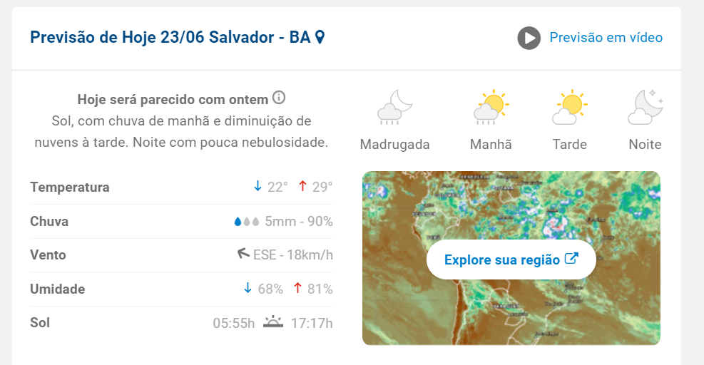

# Web scraping da previsão de tempo em Salvador 🌎

## 📐 Sobre:

Através dos estudos que havia feito para resolver um problema mais complexo no meu ambiente de trabalho; pude realizar este projeto para realizar a raspagem de dados na web. Neste caso, fiz o scraping para obter algumas informações sobre a previsão do tempo em Salvador.

## 📌 Tecnologias 
-   Python
-   Beautiful Soup
-   Requests

## 📰 Nivel de conhecimento
- Básico

## 🕣 Em andamento
- Umidade
- Chuva
- Vento
- Sol